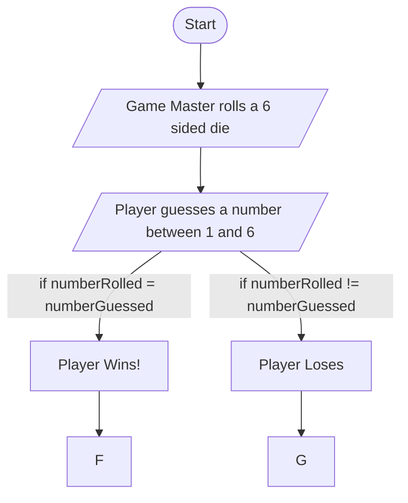

```mermaid
graph TD;
    A([Start])-->B[Game Master rolls a 6 sided die];
    B[/Game Master rolls a 6 sided die/]-->C[/Player guesses a number between 1 and 6/];
    C[/Player guesses a number between 1 and 6/]-- if numberRolled = numberGuessed -->D[Player Wins!];
    C[/Player guesses a number between 1 and 6/]-- if numberRolled != numberGuessed -->E[Player Loses];
    D-->F;
    E-->G;
```