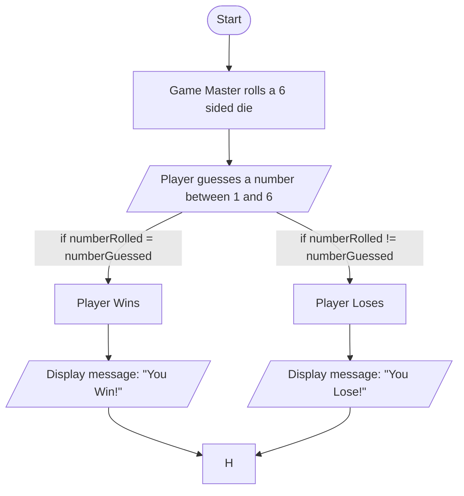

```mermaid
graph TD;
    A([Start])-->B[Game Master rolls a 6 sided die];
    B-->C[/Player guesses a number between 1 and 6/];
    C-- if numberRolled = numberGuessed -->D[Player Wins];
    C-- if numberRolled != numberGuessed -->E[Player Loses];
    D-->F[/Display message: "You Win!"/];
    E-->G[/Display message: "You Lose!"/];
    F-->H;
    G-->H;
```