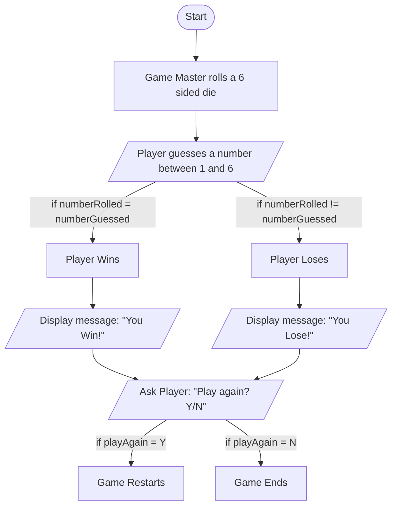

1. Game Master rolls a 6 sided die.
2. The player guesses a number between 1 and 6, hoping to match the number that was rolled.
	- If the two numbers match, the player has won the game.
	- If the two numbers do not match, the player has lost the game.
4. The player will be asked if they want to play again.
	- If the player wants to play again, the game restarts.
	- If the player does not want to play again, the game ends.